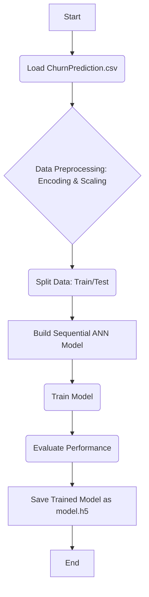
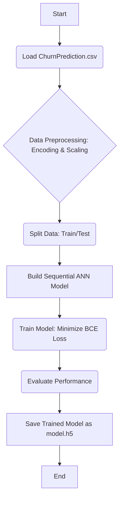

# Predicting Customer Churn Using Artificial Neural Networks (ANN) 🧠

This repository contains a deep learning project that leverages an **Artificial Neural Network (ANN)** to predict customer churn for a business. By analyzing customer behavior and demographic data, the model identifies customers at a high risk of leaving, allowing the business to implement proactive customer retention strategies.

## 🎯 Project Goal

The primary objective is to build a highly accurate predictive model capable of classifying customers as either **'Exited' (Churn)** or **'Not Exited' (Retained)** using an ANN, a method well-suited for complex pattern recognition in tabular data.

## 📁 Repository Contents

| File Name | Description |
| :--- | :--- |
| `Predicting Customer Churn Using Artificial Neural Networks.ipynb` | The main Jupyter Notebook containing the full data analysis, preprocessing, ANN construction, training, and evaluation. |
| `ChurnPrediction.csv` | The raw dataset containing customer details and the churn status (target variable). |
| `README.md` | This explanatory file. |
| `model.h5` | (Will be generated after running the notebook) The trained Keras model saved for later use. |

## 📊 Dataset Overview

The prediction is based on a dataset of customer information with the target column being **`Exited`** (1 = Churned, 0 = Retained).

Key features used for prediction include:

  * **Demographics:** `Geography` (e.g., France, Spain, Germany), `Gender`, `Age`.
  * **Financial/Account Details:** `CreditScore`, `Balance`, `EstimatedSalary`.
  * **Activity/Engagement:** `Tenure`, `NumOfProducts`, `HasCrCard`, `IsActiveMember`.

## ✨ Methodology and Workflow

The project follows a standard Machine Learning pipeline tailored for an ANN model:

### 1\. Data Preprocessing

  * **Feature Selection:** Irrelevant columns like `RowNumber`, `CustomerId`, and `Surname` are dropped.
  * **Categorical Encoding:** Nominal features (like `Geography` and `Gender`) are converted into numerical format (e.g., using One-Hot Encoding).
  * **Feature Scaling:** All numerical features are scaled (likely using `StandardScaler`) to ensure no single feature dominates the learning process.

### 2\. ANN Model Architecture

The model uses a **Keras Sequential API** architecture with **`Dense`** layers. The model typically consists of an input layer, one or more hidden layers with an activation function like ReLU, and an output layer with a Sigmoid activation for binary classification (churn/no-churn).

### Project Workflow

The following Mermaid diagram illustrates the end-to-end data flow:



## 🛠️ Prerequisites

To run the notebook, you need Python and the following libraries:

| Library | Purpose |
| :--- | :--- |
| **`pandas`** and **`numpy`** | Data manipulation and numerical operations. |
| **`matplotlib`** and **`seaborn`** | Data visualization. |
| **`scikit-learn`** | Data splitting (`train_test_split`) and scaling (`StandardScaler`). |
| **`Keras`** or **`TensorFlow`** | Building and training the Artificial Neural Network (`Sequential`, `Dense`). |

You can typically install the necessary packages using pip:

```bash
pip install numpy pandas matplotlib seaborn scikit-learn tensorflow keras
```

## ANN Model Architecture and Core Mathematics

The model is constructed using the **Keras Sequential API** and consists of several **Dense** layers, forming a fully connected network.

### The Forward Pass

Within each neuron, the inputs ($x_i$) are multiplied by their respective weights ($w_i$), summed, and a bias ($b$) is added. This weighted sum ($z$) is then passed through an activation function $g(z)$.

$$z = \sum_{i=1}^{n} (w_i x_i) + b$$

  * **Hidden Layers Activation (ReLU):** The Rectified Linear Unit ($\text{ReLU}$) is used in the hidden layers for non-linearity, aiding in learning complex decision boundaries.
    $$\text{ReLU}(z) = \max(0, z)$$
  * **Output Layer Activation (Sigmoid):** The final layer uses the **Sigmoid Activation Function ($\sigma$)** to squash the output into a probability $\hat{y}$ between 0 and 1, representing the likelihood of churn.
    $$\hat{y} = \sigma(z) = \frac{1}{1 + e^{-z}}$$

###  Optimization and Loss

The model is compiled with the **Adam Optimizer** and the **Binary Cross-Entropy (BCE)** loss function.

  * **Binary Cross-Entropy Loss (BCE):** This function measures the dissimilarity between the predicted probability ($\hat{y}$) and the true binary label ($y$). The goal of training is to minimize this loss.
    $$L(y, \hat{y}) = - \frac{1}{N} \sum_{i=1}^{N} [y_i \log(\hat{y}_i) + (1 - y_i) \log(1 - \hat{y}_i)]$$

### Project Workflow Diagram

The following Mermaid diagram illustrates the end-to-end data flow:



-----

## 🚀 How to Run the Project

1.  **Clone the Repository:**
    ```bash
    git clone https://github.com/wittyswayam/Predicting-Customer-Churn-Using-Artificial-Neural-Networks.git
    cd Predicting-Customer-Churn-Using-Artificial-Neural-Networks
    ```
2.  **Open the Notebook:**
    Launch a Jupyter Notebook or JupyterLab environment and open `Predicting Customer Churn Using Artificial Neural Networks.ipynb`.
3.  **Execute Cells:**
    Run all cells in the notebook sequentially to load the data, preprocess it, train the ANN model, and view the final prediction results and evaluation metrics. The final model will be saved as `model.h5`.

    ## Detailed Future Work and Model Enhancement

Customer churn datasets are typically **imbalanced**, where the number of churners (minority class) is much lower than retained customers (majority class). This requires moving beyond simple **Accuracy** and focusing on metrics that highlight the model's ability to identify true churners.

  * **Focus on F1-Score:** The F1-Score is the harmonic mean of Precision and Recall, providing a balanced measure of performance on imbalanced data.
    $$\text{F1-Score} = 2 \times \frac{\text{Precision} \times \text{Recall}}{\text{Precision} + \text{Recall}}$$

      * **Precision (Positive Predictive Value):** The ratio of correctly predicted positive observations to the total predicted positives. It answers: *Of all customers predicted to churn, how many actually churned?*
        $$\text{Precision} = \frac{\text{True Positives (TP)}}{\text{TP} + \text{False Positives (FP)}}$$
      * **Recall (Sensitivity):** The ratio of correctly predicted positive observations to all observations in the actual class. It answers: *Of all customers who actually churned, how many did we correctly identify?*
        $$\text{Recall} = \frac{\text{True Positives (TP)}}{\text{TP} + \text{False Negatives (FN)}}$$
